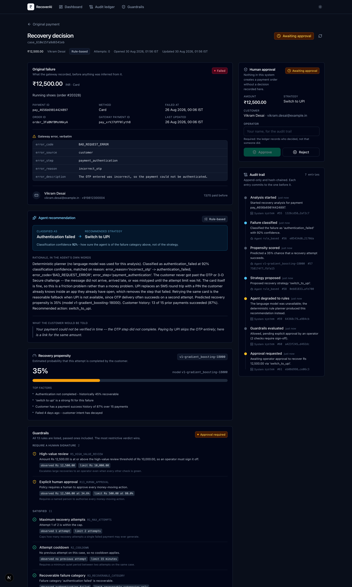
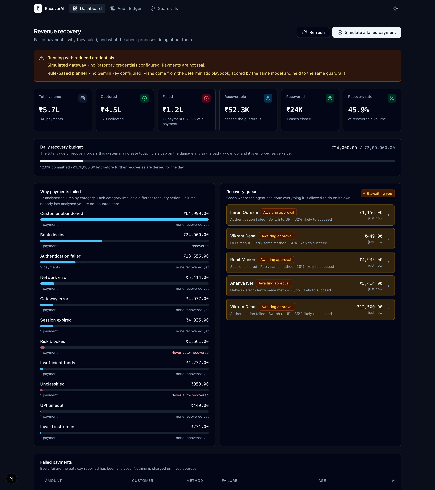
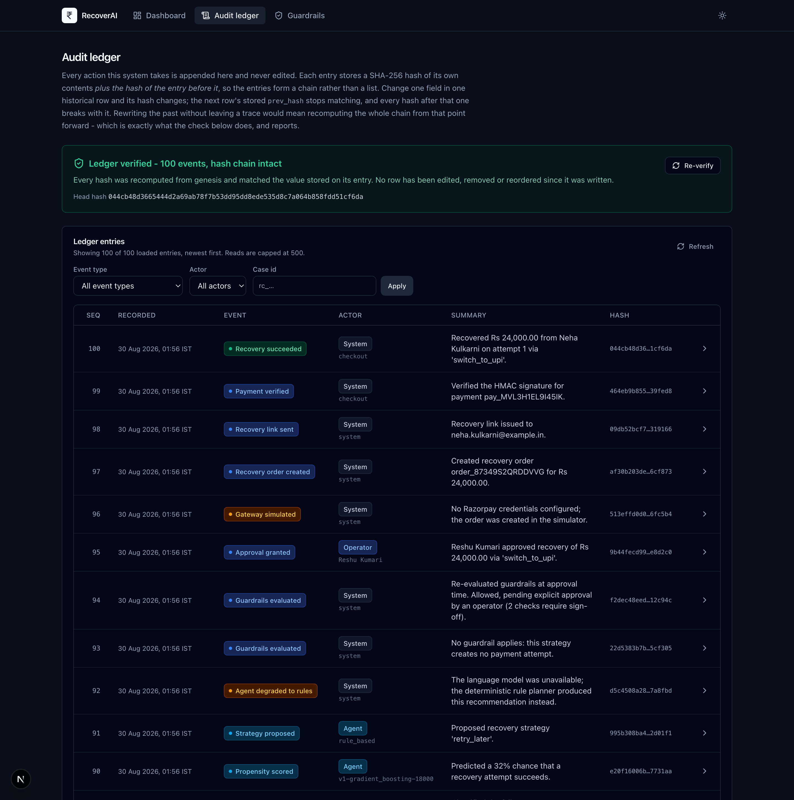
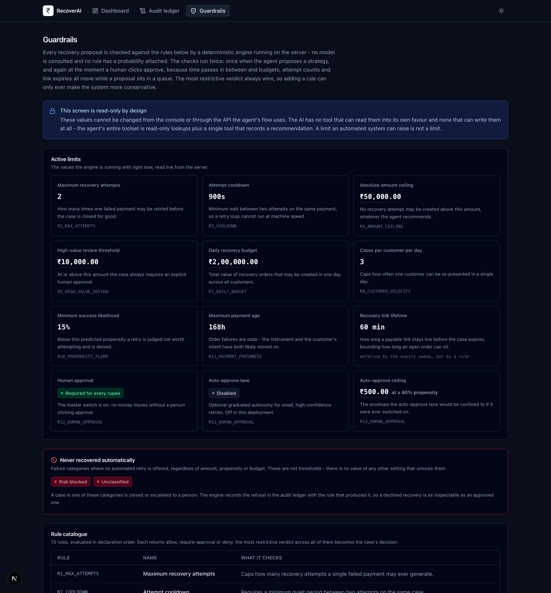
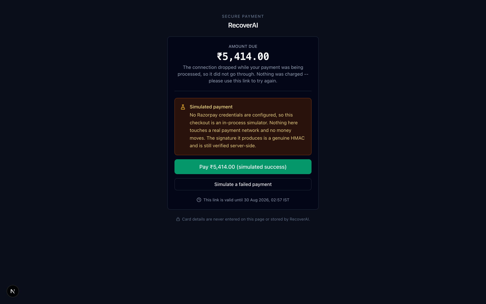

# RecoverAI

**An autonomous revenue-recovery agent for failed payments — with hard limits on what the AI is allowed to do with money.**

When a payment fails, most merchants show `Payment failed. Please try again.` and hand the
entire recovery burden to the customer. RecoverAI instead works out *why* the payment
failed, decides whether recovery is even appropriate, picks the safest strategy, and guides
the customer to completion — while a deterministic policy engine, not the AI, decides
whether any money may move.

> **AI decides. Guardrails control. Razorpay executes. Audit trail proves.**

---

## The interesting problem

The chatbot is not the interesting part. This is:

> We give an AI the ability to make a business decision about money, while deliberately
> preventing the AI from having any unilateral control over money.

The agent might conclude:

> *"This failed because the issuer declined the transaction. Re-presenting to the same card
> is unlikely to work. Recommend switching to UPI."*

That is a good recommendation. It is also just a recommendation. Before a single rupee
moves, thirteen deterministic rules run — attempt limits, cooldowns, amount ceilings,
duplicate-order prevention, a daily budget cap, per-customer velocity, an amount-integrity
check — and a human clicks Approve. Every step is written to a hash-chained ledger that can
be independently verified.

**The AI has no tool that can create an order.** Not a gated one — none. That property is
enforced by a test that fails the build if anyone adds one.

---

## Quick start

### Windows (the primary target)

Double-click **`SETUP-WINDOWS.bat`**, wait for it to finish, then double-click
**`START-WINDOWS.bat`**.

Or from a terminal:

```bat
dev.bat demo
dev.bat start
```

### macOS / Linux

```bash
python3 dev.py demo
python3 dev.py start
```

Then open **http://localhost:3000**.

**No API keys are required.** With an empty `.env` the app runs end to end using a
deterministic planner instead of Gemini and an in-process gateway instead of Razorpay.
Both are labelled in the interface — see [Running without credentials](#running-without-credentials).

Prerequisites: **Python 3.10–3.13** and **Node.js 18.18+**. Run `python dev.py doctor`
and it will tell you exactly what is missing and where to get it.

---

## The four layers

| Layer | Responsibility | Where |
|---|---|---|
| 🧠 **AI** | Understands the failure, recommends a strategy, explains itself | `backend/app/agent/` |
| 🛡️ **Guardrails** | Deterministic rules the AI cannot override or even read into its own favour | `backend/app/policy/` |
| 💳 **Razorpay** | Actually creates the order and collects the payment (Test Mode) | `backend/app/payments/` |
| 📋 **Audit** | Hash-chained, append-only record of every decision and every rupee | `backend/app/audit/` |

### How a recovery actually flows

```
Payment fails (webhook, or simulated in the demo)
        │
        ▼
┌───────────────────────────────────────────────────────────┐
│ AGENT  (read-only tools only)                             │
│   classify_failure_code   → taxonomy: 30+ Razorpay codes  │
│   get_customer_history    → prior success rate            │
│   score_recovery_propensity → scikit-learn model          │
│   get_recovery_policy     → the limits it must reason in  │
│   check_recovery_eligibility → dry-run of the guardrails  │
│   submit_recovery_plan    → a RECOMMENDATION, not an action│
└───────────────────────────────────────────────────────────┘
        │  AgentRecoveryPlan  (has no amount field, by design)
        ▼
┌───────────────────────────────────────────────────────────┐
│ POLICY ENGINE  (13 rules, pure functions, no I/O)         │
│   most-restrictive-wins → ALLOW / REQUIRE_APPROVAL / DENY │
└───────────────────────────────────────────────────────────┘
        │
        ├── DENY ─────────────► case BLOCKED. Nothing happens. Audited.
        │
        ▼ REQUIRE_APPROVAL
┌───────────────────────────────────────────────────────────┐
│ HUMAN  clicks Approve (with their name, on the record)    │
└───────────────────────────────────────────────────────────┘
        │
        ▼   ← guardrails are RE-EVALUATED here, against live state
┌───────────────────────────────────────────────────────────┐
│ RAZORPAY  Orders API · idempotency key · amount copied    │
│           from the original payment, never from the AI    │
└───────────────────────────────────────────────────────────┘
        │
        ▼
   Customer pays → server-side HMAC-SHA256 signature verification
        │
        ▼
   RECOVERED · every step appended to the hash-chained ledger
```

The re-evaluation before execution is the part that matters most. A proposal is a snapshot;
budgets move, attempts accumulate and customers get flagged between proposal and approval.
The binding check is the one that runs at the moment money would actually move.

---

## What is actually enforced

| # | Guarantee | How it is enforced |
|---|---|---|
| 1 | The LLM has **no money-moving tool** | Every tool is classified; `assert_no_financial_tools()` runs on every toolset build, and `test_agent_tool_safety.py` fails the build if the tool list changes |
| 2 | The AI **cannot change the amount** | `AgentRecoveryPlan` has no amount field and `extra="forbid"`; rule `R9_AMOUNT_INTEGRITY` denies any mismatch with the original payment |
| 3 | **No duplicate charges** | Deterministic idempotency key per attempt + a unique constraint in the database + rule `R6_DUPLICATE_ORDER` |
| 4 | **Bounded blast radius** | Max 2 attempts · 15-minute cooldown · ₹50,000 ceiling · ₹2,00,000 daily budget · 3 cases per customer per day |
| 5 | **Fraud is never retried** | `RISK_BLOCKED` and `UNKNOWN` are structurally non-recoverable |
| 6 | **A human approves every rupee** | `R13_HUMAN_APPROVAL`; the auto-approve lane exists in code but ships **off** |
| 7 | **History cannot be quietly rewritten** | SHA-256 hash chain over an append-only ledger, verifiable at `GET /api/audit/verify` |
| 8 | **A browser cannot fake a payment** | Razorpay's HMAC-SHA256 signature is verified server-side before anything is marked recovered |

---

## Tech stack

**Backend** — Python · FastAPI · SQLAlchemy 2.0 · SQLite · Pydantic v2
**AI** — Google Gemini with function calling, plus a deterministic fallback planner
**ML** — scikit-learn recovery-propensity model (Gradient Boosting vs. a Decision Tree baseline)
**Payments** — Razorpay Orders API + Checkout (Test Mode), `httpx`
**Frontend** — Next.js 15 (App Router) · TypeScript (strict) · Tailwind CSS · shadcn-style components · Zod
**Testing** — pytest

---

## Project layout

```
Reshu_Project/
├── dev.py                    One task runner for every platform
├── dev.bat / dev.sh          Thin launchers
├── SETUP-WINDOWS.bat         Double-click setup
├── START-WINDOWS.bat         Double-click start
│
├── backend/
│   ├── app/
│   │   ├── domain/           Enums, Pydantic schemas, error hierarchy
│   │   ├── db/               ORM models, session, seed data, failure scenarios
│   │   ├── agent/            Taxonomy, tools, Gemini client, orchestrator, rule planner
│   │   ├── policy/           The 13 guardrail rules and the engine
│   │   ├── ml/               Dataset, training, propensity predictor
│   │   ├── payments/         Razorpay + simulated gateway, webhook verification
│   │   ├── audit/            Hash-chained ledger
│   │   ├── services/         Business logic; owns every transaction
│   │   └── api/              Thin FastAPI routers
│   └── tests/                pytest suite
│
├── frontend/src/
│   ├── app/                  Dashboard · payment · recovery console · checkout · audit · policy
│   ├── components/           UI kit, dashboard, recovery console
│   └── lib/                  Typed API client, mirrored types, formatters
│
└── docs/                     Architecture, agent design, guardrails, API, ML, setup, demo script
```

---

## Screens

| Route | What it is for |
|---|---|
| `/` | Merchant dashboard — volume, failed, recoverable, recovered, recovery queue |
| `/payments/[id]` | One payment, its raw gateway error, and the button that starts an analysis |
| `/recovery/[id]` | **The decision console** — classification, propensity, the full guardrail checklist, the agent's tool-call trace, approve/reject, audit timeline |
| `/checkout/[id]` | The customer-facing recovery page |
| `/audit` | The full ledger, with live hash-chain verification |
| `/policy` | The active limits and the 13-rule catalogue, read-only |

---

## What it looks like

### The recovery decision — the screen the project is built around

Everything needed to authorise a payment, on one page: what the gateway actually said, what
the agent concluded and why, how likely the ML model thinks recovery is, the full
thirteen-rule guardrail checklist with passed rules included, and the approval control that
will not arm until an operator puts their name to it.



### The merchant dashboard



### The audit ledger, verified live

Press *Re-verify* and every hash is recomputed from genesis while you watch.



### The guardrail configuration — read-only by design



### The customer's view

The one screen written for the customer rather than the merchant: no console navigation, one
amount, one action — and an honest note about what mode it is running in.



---

## Running without credentials

The app is designed to run correctly with nothing configured, because a project that only
works with someone else's API keys is a project nobody can evaluate.

| Missing | What happens | Shown in the UI as |
|---|---|---|
| `GEMINI_API_KEY` | The deterministic rule-based planner runs instead. It uses the same taxonomy, the same ML score and the same guardrails, and produces a real plan — not a stub. | `Rule-based` badge |
| `RAZORPAY_KEY_ID` / `SECRET` | An in-process simulated gateway creates orders and mints **genuine HMAC signatures**, so the real server-side verification code still runs. | `Simulated` banner |
| Trained model artefact | A documented heuristic derived from the same base rates produces the score. | `Heuristic estimate` marker |

To switch either on, add keys to `backend/.env` and restart:

```bash
GEMINI_API_KEY=...            # https://aistudio.google.com/apikey
RAZORPAY_KEY_ID=rzp_test_...  # Razorpay dashboard, with the Test/Live switch on TEST
RAZORPAY_KEY_SECRET=...
```

A key beginning `rzp_live_` is **rejected at start-up**. This project is Test Mode by
design; it should not be possible to point it at real money by editing one line.

---

## Commands

```bash
python dev.py doctor     # What is installed, what is missing, how to fix it
python dev.py setup      # venv + pip install + npm install + .env files
python dev.py seed       # Rebuild the demo database (deterministic)
python dev.py train      # Train the propensity model and print its metrics
python dev.py test       # Run the test suite
python dev.py start      # Backend and frontend together
python dev.py demo       # setup + seed + train, then print the demo checklist
```

On Windows, substitute `dev.bat` for `python dev.py`.

---

## Verification

Nothing in this README is asserted without something checking it.

| What | How to run it | What it proves |
|---|---|---|
| Backend suite | `python dev.py test` | 141 tests. The policy engine is covered rule-by-rule; `test_agent_tool_safety.py` pins the exact tool list so adding a tool to the agent breaks the build; `test_audit_chain.py` tampers with a stored row and asserts the chain reports the right sequence. |
| Type safety | `cd frontend && npx tsc --noEmit` | Strict mode across the whole client, including the hand-mirrored API types. |
| Production build | `cd frontend && npm run build` | All six routes compile. |
| **Windows** | GitHub Actions, on every push | The backend suite, the model trainer, the seeder and a live zero-credential API check all run on `windows-latest` as well as Ubuntu, on Python 3.10 and 3.13. The portability claim is tested, not asserted. |

The CI workflow deliberately sets no `GEMINI_API_KEY` and no `RAZORPAY_*`, so a green run is
a live demonstration that the project works with no credentials at all.

---

## Documentation

| Document | Contents |
|---|---|
| [`docs/01-ARCHITECTURE.md`](docs/01-ARCHITECTURE.md) | System design, layering, the data model, the state machine |
| [`docs/02-AGENT-DESIGN.md`](docs/02-AGENT-DESIGN.md) | Tool architecture, the safety boundary, prompts, the fallback path |
| [`docs/03-GUARDRAILS.md`](docs/03-GUARDRAILS.md) | All 13 rules, why each limit is set where it is, the threat model |
| [`docs/04-API-REFERENCE.md`](docs/04-API-REFERENCE.md) | Every endpoint (also live at `/docs`) |
| [`docs/05-ML-MODEL.md`](docs/05-ML-MODEL.md) | Features, the dataset's generative process, metrics, the recall trade-off |
| [`docs/06-SETUP.md`](docs/06-SETUP.md) | Installation, Windows notes, Razorpay and Gemini setup, troubleshooting |
| [`docs/07-DEMO-SCRIPT.md`](docs/07-DEMO-SCRIPT.md) | A five-minute walkthrough, scene by scene |
| [`docs/08-DESIGN-DECISIONS.md`](docs/08-DESIGN-DECISIONS.md) | The choices that had real alternatives, and why they went the way they did |

---

## Honest limitations

Stated plainly, because a project that claims no weaknesses invites the reviewer to go
looking for them.

- **The propensity model is trained on synthetic data.** No public dataset of Razorpay
  recovery outcomes exists. The generative process is fully documented in
  `docs/05-ML-MODEL.md` so its assumptions can be audited rather than taken on trust. The
  model architecture and evaluation are real; the ground truth is stated as synthetic
  everywhere it is reported.
- **`RETRY_LATER` parks the case rather than scheduling it.** Time-delayed retries need a
  job scheduler, which is deliberately out of scope for v1. The case is marked `NO_ACTION`
  with the reasoning recorded.
- **Single-merchant, single-currency.** Every guardrail limit is denominated in paise;
  multi-currency would require per-currency limits.
- **There is no authentication anywhere, and that has a wider blast radius than it sounds.**
  The approver types a name; nothing verifies it. But the same is true of every endpoint:
  `GET /api/payments` returns the merchant's customer list with names and email addresses to
  anyone who can reach the port. The server binds to `127.0.0.1` and is meant to be run
  locally by one person, which is the only reason that is tolerable. Case ids are 64-bit
  random, so they cannot be guessed, and the public checkout page sends no contact details
  unless Razorpay's hosted Checkout actually needs them for prefill. Real deployment needs
  SSO and a role check before anything else on this list; the audit trail is already built to
  record whatever identity it is given, so that change touches one field.

---

Built by **Reshu Kumari** — [reshubarnwal476@gmail.com](mailto:reshubarnwal476@gmail.com)
